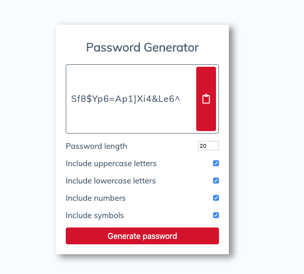

# 03 JavaScript: Password Generator

This is an application that generates a random password based on user-selected criteria. This app will run in the browser and feature dynamically updated HTML and CSS powered by JavaScript code.

This project has been completed with no known bugs and can be viewed [here](https://kelly70ve.github.io/Password_Generator/). The project is responsive and can be viewed on mobile, tablet or desktop.

--- 

## Project Goals:

- User can enter the length of their password of 8 - 128 characters
  - If user selects a password that is not between 8 - 128 characters, a password will not be generated
- User can choose what type of characters they would like to be included in their password 
  - Options they may chose from are: lowercase, uppercase, numeric, and/or special characters
- Once user has entered their password criteria, the generated password will display their password in the results container. 
- User may click on clipboard button to copy password to their clipboard.

--- 

## Project Preview

---

## Technologies Used

- [HTML](https://developer.mozilla.org/en-US/docs/Web/HTML)
- [CSS](https://developer.mozilla.org/en-US/docs/Web/CSS)
- [Favicon.io](https://favicon.io/)
- [Font Awesome](https://fontawesome.com/)
- [Google Fonts](https://fonts.google.com/)

## Helpful Resources 

- [Character Set Table](http://www.net-comber.com/charset.html)

- - -
© 2019 Trilogy Education Services, a 2U, Inc. brand. All Rights Reserved.
